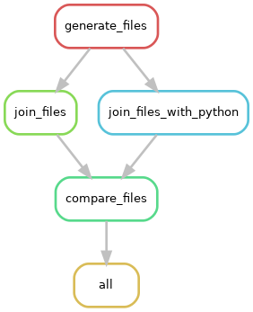

# Session I
### `Snakefile`
This introduces the concepts of rules, input and output, using shell commands and external scripts and
how to use the `expand()` function. It is easiest to run each rule in this file separately by specifying the rule name 
as follows:
```
$ snakemake -j 1 count_words --dry-run
$ snakemake -j 1 count_words
```
### `Snakefile_3rules.smk`
This file introduces the concept of chaining together a number of rules to create a workflow. We first generate
a file containing a list of letters and another file containing a list of numbers, and join them together using
shell commands or python. We then compare the 2 joined files.



```
$ snakemake --snakefile Snakefile_3rules.smk
```
### `Snakefile_wildcards.smk`
This file introduces the concept of wildcards. When you have many input files with a consist naming pattern
and you want the same tasks done on them, a workflow management software like Snakemake makes your job much easier. 
We created some files in the `data_files/` folder earlier (the `generate_data_files` rule in `Snakefile`) which will
 be used as input for this workflow. The aim is to take each of the 10 text files and edit them and save them in 
 `edited_files/`. 
 Run this file as follows:
```
$ snakemake --snakefile Snakefile_wildcards.smk
```
See if you can make the `input` for rule `all` more concise by using the `expand()` function.

Now, read the TODO section and see if you can write two more rules following the instructions in the Snakefile
and modify `input` for rule `all` accordingly. A possible solution for this can be seen in the `Snakefile_wildcards_solution.smk`
file. 